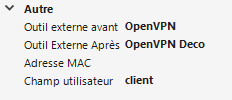

# mRemoteNG OpenVPN External tool

## Synopsis
Connect to OpenVPN via mRemoteNG external tool.
 
## Description
- Automatically connect to the right OpenVPN configuration before attempting to connect to the RDP.
  - Can detect if OpenVPN is already running with the right configuration.
- When connecting, the script will try to read the logfile and close when connected. **// TODO : Stop if error**
  - If not able to access the logfile, then wait 15 sec.
- Automaticlly disconnect the VPN when the RDP connection is closed.
  - Before disconnecting the VPN, the script can check if there are others connected session in mRemoteNG still needing the VPN.


## Configuration

### External Tool
The Userfield is used to pass parameters.\
Two external tools are needed, one to connect and another to disconnect. \
They must have the option 'Wait for exit' enabled : 

#### Connection :
```Bash
"path\to\file\RDPOpenVPN.ps1" -u %USERNAME% -p %PASSWORD% -config %USERFIELD%
```

#### Disconnection :
```Bash
"path\to\file\RDPOpenVPN.ps1" -deco -config %USERFIELD%
```


### Session Configuration 
Userfield should contain the OpenVPN configuration name and `-askdeco` if needed.

Before external tool = Connection\
After external tool = Disconnection 



</br>
PS: OpenVPN folder should be added in `PATH` or the folder location must be added in the script. \ 

PPS: Enable silent connection in OpenVPN-gui.

___


|<div style="width:115px">PARAMETER</div>|INFO|
|----------------------------------------|----|
|-deco|Used for disconnection.|
|-askdeco|Will prevent the disconnection if there are other connected session in mRemoteNG with the same onfig.|
|-vpn \<string\>|For future improvement, if more vpn can be added.|
|-config \<string\>|The name of the OpenVPN config.|
|-u \<string\>|Used to retrieve the username from mRemoteNG.|
|-p \<string\>|Used to retrieve the password from mRemoteNG. </br>**/!\ Special Character Escaping /!\\**. Check [doc](https://mremoteng.readthedocs.io/en/latest/user_interface/external_tools.html#special-character-escaping) for more info.|
|-w \<int\>|Set a wait time in sec if the script was not able to find the VPN log. Default is 15 sec.|
        
    
I lost the game.
